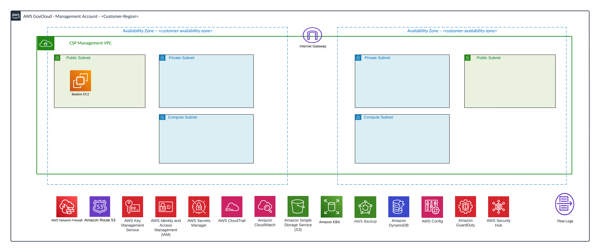

## Coalfire AWS RAMPpak

## Description

Coalfire created reference architecture for FedRAMP AWS builds. This repository is used as a parent directory to deploy Coalfire-CF/`terraform-aws-<service>` modules.

Learn more at [Coalfire OpenSource](https://coalfire.com/opensource).

## Architecture



## Dependencies

- AWS Account
- AWS CLI is installed

## Resource List

| Directory | Purpose |
| --------- | ------- |
| `aws/terraform/us-gov-west-1/management-account/day0` | Account Setup Terraform files |
| `aws/terraform/us-gov-west-1/global-vars.tf` | Global variables |
| `aws/terraform/us-gov-west-1/networking` | Networking deployment Terraform files |
| `aws/terraform/us-gov-west-1/org-creation` | AWS Organization Terraform files |
| `aws/terraform/us-gov-west-1/org-onboarding` | AWS Organization Onboarding Terraform files |

## Code Updates

1. Update `global-vars.tf` in `aws/terraform/us-gov-west-1/global-vars.tf`
2. Update `tstate.tf`  in each directory (when applicable). Example below:

``` hcl
terraform {
  required_version = ">=1.5.0"
  required_providers {
    aws = {
      source  = "hashicorp/aws"
      version = "~> 5.0"
    }
}
  backend "s3" {
    bucket         = "pak-us-gov-west-1-tf-state"
    region         = "us-gov-west-1"
    key            = "pak-us-gov-west-1-tfsetup.tfstate"
    dynamodb_table = "pak-us-gov-west-1-state-lock"
    encrypt        = true
  }
}
```

3. Update `remote-data.tf`in each directory (when applicable). Example below:

``` hcl
data "terraform_remote_state" "day0" {
  backend = "s3"

  config = {
    bucket  = "${var.resource_prefix}-${var.aws_region}-tf-state"
    region  = var.aws_region
    key     = "${var.resource_prefix}-${var.aws_region}-tfsetup.tfstate"
    profile = "pak-mgmt"
  }
}
```

3. Update `vars.tfvars` in each directory (when applicable).

## Deployment Steps

1. Log in with with AWS creds into AWS CLI. `aws configure'.
2. Navigate to `aws/terraform/us-gov-west-1/management-account/day0` and run `terraform init` and `terraform plan`. If everything looks correct, then run `terraform apply`.
3. Navigate to `aws/terraform/us-gov-west-1/org-creation` and run `terraform init` and `terraform plan`. If everything looks correct, then run `terraform apply`.
4. Navigate to `aws/terraform/us-gov-west-1/org-onboarding` and run `terraform init` and `terraform plan`. If everything looks correct, then run `terraform apply`.
5. Navigate to `aws/terraform/us-gov-west-1/networking` and run `terraform init` and `terraform plan`. If everything looks correct, then run `terraform apply`.
6. Navigate to `aws/terraform/us-gov-west-1/management-account/bastion` and run `terraform init` and `terraform plan`. If everything looks correct, then run `terraform apply`.

## Deployment Configurations

- Ensure that the `vars.tfvars` file is never uploaded or committed to any public repository platform (e.g., GitHub, GitLab, Bitbucket, etc.). This file contains sensitive information and should be kept private.

<!-- BEGIN_TF_DOCS -->
## Requirements

No requirements.

## Providers

No providers.

## Modules

No modules.

## Resources

No resources.

## Inputs

No inputs.

## Outputs

No outputs.
<!-- END_TF_DOCS -->

## Contributing

If you're interested in contributing to our projects, please review the [Contributing Guidelines](CONTRIBUTING.md). And send an email to [our team](mailto:contributing@coalfire.com) to receive a copy of our CLA and start the onboarding process.

## License

[](https://opensource.org/license/mit/)

### Copyright

Copyright © 2024 Coalfire Systems Inc.
